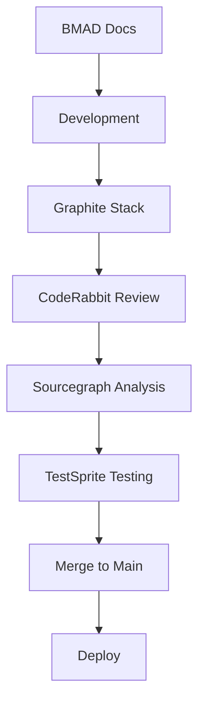

# BMAD-Enhanced Development Workflow for Adify

## Complete Development Stack

### Core Technologies
- **Frontend**: React + TypeScript + Vite + Tailwind
- **AI**: Google Gemini Pro Vision
- **Version Control**: Git + Graphite (stacked PRs)
- **Code Review**: CodeRabbit MCP (AI-powered)
- **Code Intelligence**: Sourcegraph AMP (formerly Cody)
- **Testing**: TestSprite MCP + Vitest + Playwright
- **Documentation**: BMAD methodology

## Workflow Overview



## Step-by-Step Development Process

### 1. Start New Feature

```bash
# Create new stack with Graphite
gt stack create

# Create feature branch
gt branch create feat/your-feature-name
```

### 2. Document First (BMAD)

Before coding, update relevant BMAD docs:
- `BMAD-docs/product-brief.md` - If changing product vision
- `BMAD-docs/prd.md` - For new features
- `BMAD-docs/architecture.md` - For technical changes
- `BMAD-docs/front-end-spec.md` - For UI changes

### 3. Write Tests (TDD)

```bash
# TestSprite will help generate tests
npm run test:generate

# Or write manually in:
# - src/__tests__/unit/ (unit tests)
# - src/__tests__/integration/ (integration)
# - e2e/ (end-to-end)
```

### 4. Implement Feature

Write your code with these tools helping:
- **Sourcegraph AMP**: Auto-completes and suggests refactors
- **Live Type Checking**: TypeScript validates as you type
- **Design Rules**: Follow constants.ts patterns

### 5. Quality Checks

```bash
# Run all checks
npm run lint
npm run typecheck
npm test
npm run test:coverage
```

### 6. Commit with Graphite

```bash
# Stage changes
gt add -A

# Commit with conventional message
gt commit -m "feat: add video generation support"
```

### 7. Automated Reviews

On commit, these MCPs activate:
- **CodeRabbit**: Reviews code quality, security, best practices
- **Sourcegraph AMP**: Suggests optimizations and refactors
- **TestSprite**: Verifies test coverage meets 80% minimum

### 8. Submit for Review

```bash
# Submit stack to GitHub
gt submit

# This creates/updates PRs with:
# - Stacked changes
# - Review comments from MCPs
# - Test results
```

### 9. Address Feedback

```bash
# Make requested changes
# Then update the stack
gt stack update
gt submit
```

### 10. Merge & Deploy

```bash
# After approval, merge via GitHub
# Or use Graphite CLI
gt merge

# Deployment is automatic on merge to main
```

## MCP Integration Details

### CodeRabbit MCP

**Location**: `.claude/mcps/coderabbit-config.json`

**Features**:
- Async code review on every commit
- Security vulnerability detection
- Performance issue identification
- Best practice enforcement
- Automatic PR comments

**Commands**:
```bash
# Trigger manual review
coderabbit review

# View latest report
open test-docs/coderabbit-reports/latest.md
```

### Sourcegraph AMP (formerly Cody)

**Location**: `.claude/mcps/sourcegraph-amp-config.json`

**Features**:
- Semantic code search across project
- Smart refactoring suggestions
- Complexity analysis
- Dead code detection
- Cross-repository navigation

**Usage**:
- Auto-completes as you type
- Suggests improvements in real-time
- Weekly quality reports in `test-docs/amp-reports/`

### TestSprite MCP

**Location**: `test-docs/testsprite-config.json`

**Features**:
- AI-powered test generation
- Coverage tracking (80% minimum)
- E2E test scenarios
- Mock data generation for Gemini API
- Test maintenance and updates

**Commands**:
```bash
# Generate tests for new code
npm run test:generate

# Update existing tests
npm run test:update

# View coverage report
npm run test:coverage
open test-docs/reports/coverage/index.html
```

## Graphite Workflow

### Stack-Based Development

Instead of feature branches, use stacks:
```bash
# View current stack
gt stack

# Create new branch in stack
gt branch create fix/bug-name

# Submit entire stack
gt submit

# Update stack with main
gt stack update
```

### Benefits:
- Smaller, focused PRs
- Parallel review and merge
- Better code organization
- Cleaner git history

## Environment Management

### Local Development

`.env.local`:
```env
GEMINI_API_KEY=your_key_here
VITE_APP_ENV=development
```

### GitHub Secrets (Production)

Set in repo settings:
- `GEMINI_API_KEY`
- `VERCEL_TOKEN`
- `CODERABBIT_TOKEN`
- `SOURCEGRAPH_TOKEN`

## Quality Gates

### Pre-Commit
- Lint passes
- TypeScript compiles
- Tests pass
- Coverage >= 80%

### Pre-Merge
- CodeRabbit approval
- Human review
- All CI checks green
- No security issues

### Post-Merge
- Auto-deploy to staging
- Smoke tests pass
- Performance metrics OK
- Error rate < 1%

## Troubleshooting

### CodeRabbit Issues
```bash
# Check config
cat .claude/mcps/coderabbit-config.json

# View logs
tail -f .claude/logs/review.log

# Trigger manual review
git commit --amend
```

### Sourcegraph AMP Issues
```bash
# Reindex project
sourcegraph index --force

# Clear cache
rm -rf .sourcegraph/cache

# Check connection
sourcegraph status
```

### TestSprite Issues
```bash
# Regenerate tests
npm run test:generate -- --force

# Update snapshots
npm test -- -u

# Debug specific test
npm test -- --grep "test name"
```

### Graphite Issues
```bash
# Sync with remote
gt repo sync

# Fix stack conflicts
gt stack fix

# Reset to clean state
gt stack reset
```

## Best Practices

### 1. Documentation First (BMAD)
- Always update docs before coding
- Keep BMAD docs as source of truth
- Generate code from specifications

### 2. Test-Driven Development
- Write tests before implementation
- Maintain 80% coverage minimum
- Test edge cases and errors

### 3. Small, Focused Changes
- One feature per stack
- Multiple small commits
- Clear commit messages

### 4. Continuous Quality
- Fix issues immediately
- Address MCP feedback
- Keep tech debt low

### 5. Collaborative Development
- Use PR templates
- Respond to reviews quickly
- Share knowledge in docs

## Quick Reference

### Daily Workflow
```bash
# Morning
gt repo sync              # Sync with team
npm install              # Update dependencies
npm test                 # Verify tests pass

# During Development
gt branch create feat/X  # Start feature
npm run dev              # Run dev server
npm test -- --watch      # Test as you code

# Before Break
gt commit -m "wip: ..." # Save progress
gt submit               # Push to GitHub

# End of Day
npm run test:coverage   # Check coverage
gt stack                # Review stack
gt submit              # Final push
```

### Emergency Commands
```bash
# Rollback last commit
gt reset HEAD~1

# Fix broken tests
npm test -- --no-coverage --bail

# Quick deploy bypass
git push origin main --force-with-lease

# Reset everything
rm -rf node_modules package-lock.json
npm install
```

## Success Metrics

- **Code Quality**: CodeRabbit score > 90%
- **Test Coverage**: > 80% all categories
- **Performance**: Lighthouse score > 90
- **Security**: Zero vulnerabilities
- **Documentation**: 100% feature coverage

---

This workflow ensures high-quality, well-tested, thoroughly reviewed code with excellent documentation. The MCPs work together to catch issues early and maintain consistency.